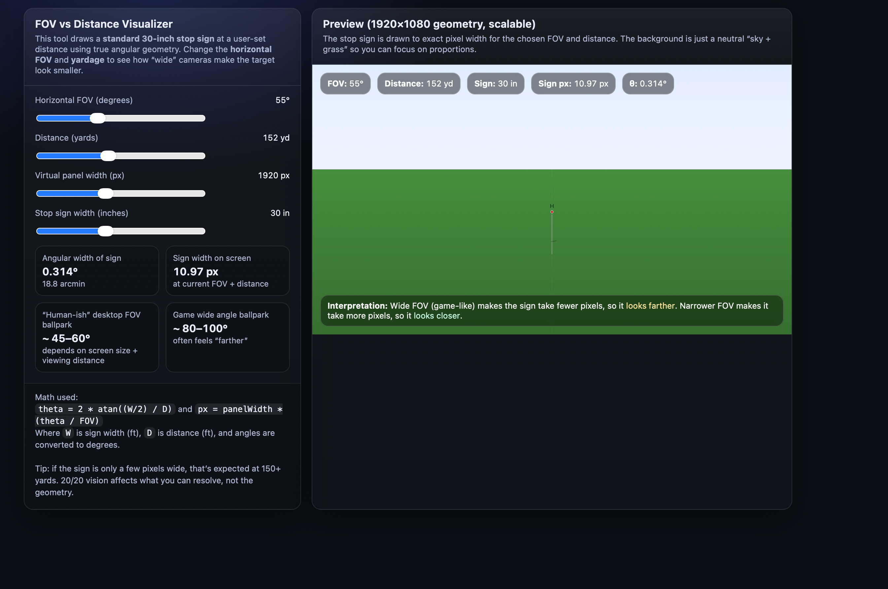

# FOV vs Distance Visualizer

Interactive tool that draws a standard stop sign at a user-set distance using true angular geometry. Change the horizontal FOV and yardage to see how "wide" cameras make the target look smaller.

**[Try it live](https://tayloropenlaunch.github.io/Fov_Tool/)**

## Features

- Adjustable horizontal FOV (20-120 degrees)
- Distance slider (10-350 yards)
- Configurable virtual panel width and stop sign size
- Real-time canvas preview with exact pixel-width rendering
- Shows angular width (degrees and arcminutes) and pixel width on screen

## How it works

Uses `theta = 2 * atan((W/2) / D)` and `px = panelWidth * (theta / FOV)` where W is sign width (ft), D is distance (ft), and angles are converted to degrees.

## License

MIT
